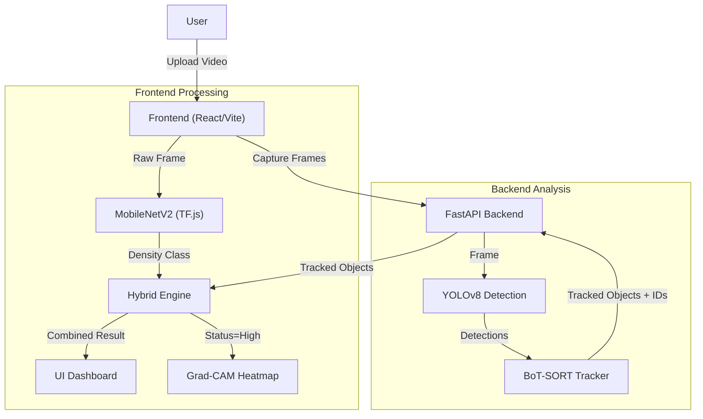

# DeepTraffic-GradCAM

A hybrid traffic analysis system combining YOLOv8 detection, BoT-SORT multi-object tracking, and MobileNetV2 density classification with Grad-CAM visualization.

## Architecture

This project uses a hybrid approach to analyze traffic density:



1.  **Backend (Python/FastAPI)**:
    *   **YOLOv8**: Performs real-time object detection.
    *   **BoT-SORT**: Tracks vehicles across frames to assign persistent IDs.
    *   **API**: Exposes endpoints for inference and model information.

2.  **Frontend (React/Vite)**:
    *   **Dashboard**: Displays real-time video feed with bounding boxes and track IDs.
    *   **MobileNetV2**: Runs in-browser classification for density estimation.
    *   **Grad-CAM**: Visualizes attention maps for density classification.

## Setup Instructions

### 1. Backend Setup

1.  Navigate to the backend directory:
    ```bash
    cd backend
    ```

2.  Create and activate a virtual environment:
    ```bash
    python3 -m venv venv
    source venv/bin/activate  # On Windows: venv\Scripts\activate
    ```

3.  Install dependencies:
    ```bash
    pip install -r requirements.txt
    ```

4.  Start the FastAPI server:
    ```bash
    python main.py
    ```
    The server will start at `http://localhost:8000`.

### 2. Frontend Setup

1.  Install Node.js dependencies:
    ```bash
    npm install
    ```

2.  Start the development server:
    ```bash
    npm run dev
    ```

3.  Open the application in your browser (usually `http://localhost:8080`).

## Usage

1.  Upload a traffic video to the dashboard.
2.  The system will automatically process frames:
    *   YOLOv8 detects vehicles.
    *   BoT-SORT assigns persistent IDs.
    *   Frontend displays the video with overlaid bounding boxes and statistics.

## Project Structure

*   `backend/`: Python FastAPI application and model weights.
    *   `main.py`: Server entry point.
    *   `botsort.yaml`: Tracker configuration.
    *   `models/`: Directory for YOLO weights (`best.pt`).
*   `src/`: React frontend source code.
    *   `components/`: UI components (VideoFeed, DetectionOverlay, etc.).
    *   `hooks/`: Custom hooks (`useYOLODetection`, `useTrafficInference`).

## Technologies

*   **Python**: FastAPI, Ultralytics (YOLOv8), OpenCV, NumPy
*   **TypeScript/React**: Vite, Tailwind CSS, TensorFlow.js

